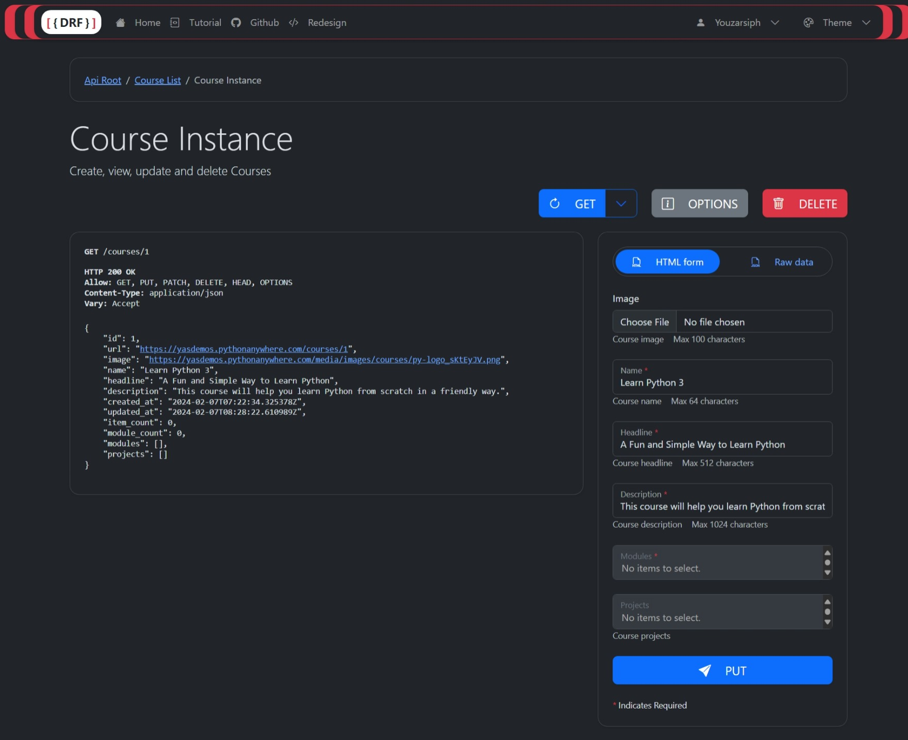
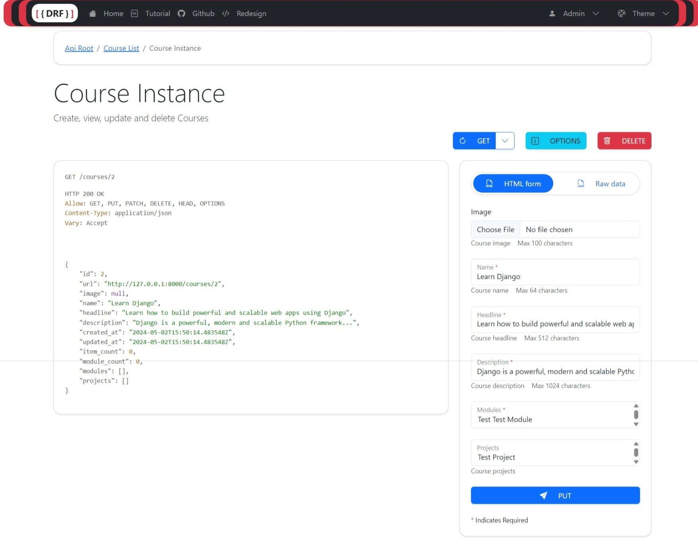

# 🚀 drf-redesign

[](https://github.com/youzarsiph/drf-redesign/actions/workflows/ruff.yml)
[](https://github.com/youzarsiph/drf-redesign/actions/workflows/python-publish.yml)
[](https://github.com/youzarsiph/drf-redesign/actions/workflows/django.yml)

**drf-redesign** is a project that gives a fresh look to the browse-able API of Django REST Framework using Bootstrap 5.

We want to make the API more **appealing** and **intuitive** for developers and users alike.
That's why we created a **stylish** and **modern** design that makes the API easier to navigate and interact with.
One of the coolest features of drf-redesign is the **dark mode** option.
You can switch to a dark theme that is not only **eye-friendly** but also **super cool**.

Our goal with drf-redesign is to make your life easier when working with Django REST Framework.
We think that by enhancing the user experience, we can help you save time and be more efficient.

So if you're looking for a better way to work with Django REST Framework, don't miss drf-redesign.
We're sure you'll enjoy it as much as we do!

## 🌟 Features

- **Modern design**: drf-redesign uses Bootstrap 5, the latest version of the most popular front-end framework,
  to create a sleek and responsive design for the API.
- **Accessibility**: drf-redesign follows the best practices for web accessibility,
  ensuring that the API is easy to use for everyone, regardless of their abilities or preferences.
- **Light and dark themes**: drf-redesign lets you choose between a light or a dark color scheme for the API,
  depending on your mood or environment. You can switch between the themes with a simple click of a button.
- **Bootstrap icons**: drf-redesign uses Bootstrap icons, a set of open source icons designed for Bootstrap components,
  to add some visual flair to the API. The icons are scalable, customizable, and easy to use.
- **Form input max length indicators**: drf-redesign shows the maximum length of each form input field,
  so you know how much data you can enter. The indicators also change color when you reach the limit, giving you visual feedback.
- **Form inputs required indicators**: drf-redesign marks the required form input fields with an asterisk (\*),
  so you know which fields are mandatory to submit the form. The indicators also show an error message if you try to submit the form without filling the required fields.
- **Browser form validation**: drf-redesign uses the built-in browser form validation features, such as HTML5 attributes,
  to validate the form input data before sending it to the server. The validation checks for formats, patterns, ranges, and more.

## Screenshots


DRF Redesign Dark Mode


DRF Redesign Light Mode

## 🛠️ Get started

To use drf-redesign, follow these simple steps:

Install the package:

```console
pip install drf-redesign
```

Add `drf_redesign` to `INSTALLED_APPS` setting, before `rest_framework`

```python
# settings.py

INSTALLED_APPS = [
    ...,
    'drf_redesign',
    'rest_framework',
    ...
]
```

That's it! You're ready to go. 😎

I hope you find this useful. Let me know if you have any feedback or questions. 😊
